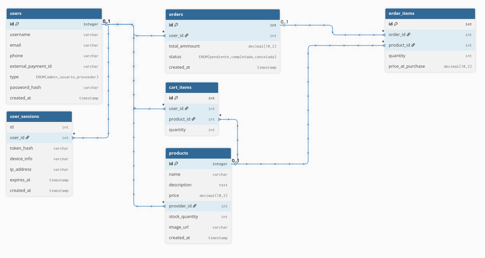

# CartMonitor: A Pure PHP Layered E-commerce Engine



CartMonitor es un motor de comercio electrónico de alto rendimiento desarrollado íntegramente en **PHP 8.2 (Vanilla)**. El proyecto demuestra una plataforma transaccional robusta, segura y escalable sin depender de frameworks externos, utilizando una arquitectura de capas estricta y contenedores Docker para un despliegue universal.

---

## Características Principales

- **Arquitectura en Capas**: Se presenta la división clara entre Rutas, Controladores, Servicios y Repositorios.
- **Seguridad Integral**: Protecciones nativas contra SQL Injection (Prepared Statements), CSRF (Tokens dinámicos) y XSS (Escape sistemático).
- **Checkout Transaccional**: Manejo de concurrencia y bloqueo de stock mediante transacciones de base de datos (`FOR UPDATE`).
- **Diseño UI UX Personalizado**: Basado en un diseño Maximalista tecnico, es una interfaz profesional de alto contraste optimizada para paneles de administración y catálogos densos.
- **Multi-Rol**: Soporte para Usuarios, Proveedores y Administradores.

---

## Guía de Instalación (Paso a Paso)

### 1. Clonar el Repositorio
Independientemente de tu sistema operativo, comienza descargando el código:
```bash
git clone https://github.com/tu-usuario/CartMonitor.git
cd CartMonitor
```

### 2. Configuración de Entorno
Copia el archivo de variables pre-configuradas:
```bash
cp .env.example .env
```
> ***Nota**: El archivo viene pre-configurado para funcionar con el entorno Docker por defecto "out-of-the-box".*

---

### Despliegue Universal (Docker)

El orquestador está configurado para resolver automáticamente directorios, permisos de carga (`chmod`) y enlaces simbólicos (`ln -s`) al iniciar, garantizando la misma experiencia "One Click Run" en **Windows, macOS y Linux**.

Abre tu terminal favorita (o PowerShell en Windows) en la carpeta del proyecto y ejecuta:
```bash
docker compose up -d --build
```
> ***Nota**: Asegúrate de tener instalado [Docker Desktop](https://www.docker.com/products/docker-desktop/) (Windows/macOS) o Docker Engine (Linux).*

```bash
docker compose up -d # Para correr el proyecto en docker una vez construido
```
---

## Acceso Rápido al Sistema

Una vez finalizada la carga de los contenedores (`docker ps` para verificar), los datos base se habrán inyectado vía **Seeds**. 
Accede desde tu navegador:

- **Frontend**: [http://localhost:8081](http://localhost:8081)

### Credenciales de Prueba (Precargadas)
- **Administrador**: `admin@cartmonitor.com` / `admin123`
- **Proveedor de Inventario**: `proveedor@cartmonitor.com` / `admin123`

---

## Estructura del Proyecto

```text
├── app/
│   ├── Controllers/  # Orquestación de peticiones
│   ├── Core/         # Kernel del sistema (Router, DB Singleton, Config)
│   ├── Repositories/ # Capa de Persistencia (Abstracción de PDO)
│   ├── Services/     # Lógica de Dominio (Validaciones complejas y transacciones)
│   └── Routes/       # Definiciones de URLs (web.php)
├── public/           # Punto de entrada (index.php) y Assets
├── resources/views/  # Plantillas UI (Bootstrap 5)
├── storage/images/   # Almacenamiento persistente de productos
└── database/         # Esquemas SQL e inicialización
```

> [!WARNING]
> Esto es un proyecto en docker, si terminaste de hacer pruebas no olvides eliminar los recursos del docker usando:
> ```bash
> docker compose down -v # para eliminar el volumen y la base de datos
> ```
> Recuerda usar "docker ps" para verificar que los contenedores se hayan detenido y eliminado.
> Para elimnar el docker completo (con todos los contenedores, volumenes, etc) usa:
> ```bash
> docker compose down -v --rmi all --remove-orphans
> ```
---

## Licencia
Este proyecto fue desarrollado con fines educativos y de portafolio profesional bajo la arquitectura de software avanzada.